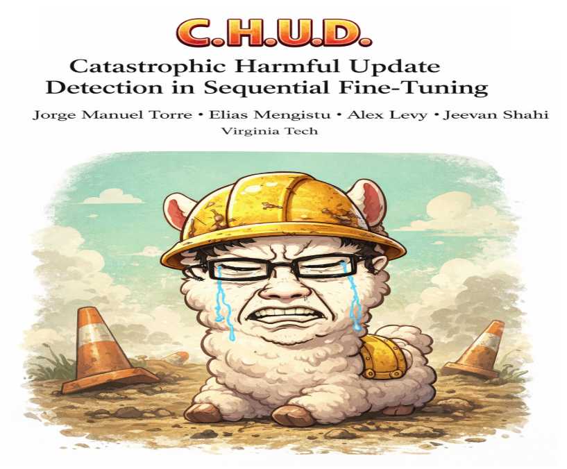

# C.H.U.D - Catastrophic Harmful Update Detection



## Setup
The original paper left us some helpful scripts and instructions:

1. Download the datasets by following the instructions in [`data/README.md`](./data/README.md)

2. Either download the models we'll be using into `models/` or authenticate via huggingface, see below:
    - **Base Model**: Llama-2-7b-hf [**[link]**](https://huggingface.co/meta-llama/Llama-2-7b-hf)
    - **Safety-Aligned Model**: Llama-2-7b-chat-hf [**[link]**](https://huggingface.co/meta-llama/Llama-2-7b-chat-hf)

3. Follow the instructions in [`README.md`](README.md) to setup the conda environment. 

3. Generate the safety-aligned model with [`LoX.py`](safety/LoX.py):
```bash
python safety/CHUD_LoX.py \
    --save-path models/Llama-2-7b-LoX \
    --limit-memory
```
> By default this loads the `Llama-2-7b-chat-hf` and `Llama-2-7b-hf` models from Huggingface. May require you to authenticate. If using local models, use the `--model` and `--base-model` flags.

> I added some optimizations to reduce memory (`--limit-memory` flag), but this still used around 42Gb of memory on my machine, so if it doesn't work lmk. By default this extrapolates the full rank of the safety deltas, we can experiment with different ranks (`--k`) and extrapolation coefficients (`--coef`).


## Evaluation (ASR)
The original paper used OpenAI's `gpt-4o-mini` for evaluations, which is a paid model. Their scoring evaluation was based on a 1-5 range, but we'll use a guard model (as per prof's recommendation) that will just use a binary 'safe' vs. 'unsafe' scoring model. To this end, I've revised the `utils.py` prompt and scoring helpers and `CHUD_ASR.py` to use the [`Llama-Guard-38-B`](https://huggingface.co/meta-llama/Llama-Guard-3-8B). 
> Either download the guard model and use locally, or stream with transformers (default config, ~16GB).

Run with:
```bash
python safety/CHUD_ASR.py \
    --model models/Llama-2-7b-LoX
```
> Use a local judge model with `--judge-model`, or stream `Meta-Llama-3.1-8b-Instruct` from huggingface. Output is saved to `eval/gens.csv` by default. 

> Generating model responses takes ~30 seconds per sample for the LoX'd model, default is 100 samples (use `--n` to change). I recommend testing first with like ~5 samples to catch any auth errors before you sink time into a more complete evaluation.
>
> Judging each model response takes ~15 seconds per sample with the LLama Guard model.
>
> Saves to the output csv `eval/` by default, use `--save-dir` to change. 

## Fine-Tuning
We'll need to use a PEFT adapter since we are memory limited. QLORA makes the most sense here. [Here](https://mlflow.org/docs/latest/ml/deep-learning/transformers/tutorials/fine-tuning/transformers-peft/) is a good reference.

 See the implementation (WIP) at [`fine-tuning-attacks/CHUD_finetune.py`](./fine-tuning-attacks/CHUD_finetune.py). Run with:
 ```bash
python fine-tuning-attacks/CHUD_finetune.py \
  --model meta-llama/Llama-2-7b-chat-hf \
  --data-path data/gsm/train.jsonl \
  --save-dir models/benign/
 ```
 Which will save the trained PEFT adapter to `models/benign/`. This fine-tunes 10 samples in well under a minute, 500 samples in ~20 mins.
> You may have to recreate the conda environment, since I've changed [`environment.yaml`](./environment.yaml) to support this script. 

> We still need to align the fine-tuning hyperparameters as per the LoX paper (see section 5).

We need to determine (ask prof) if QLoRA is a reasonable mechanism for exploiting catastrophic forgetting.